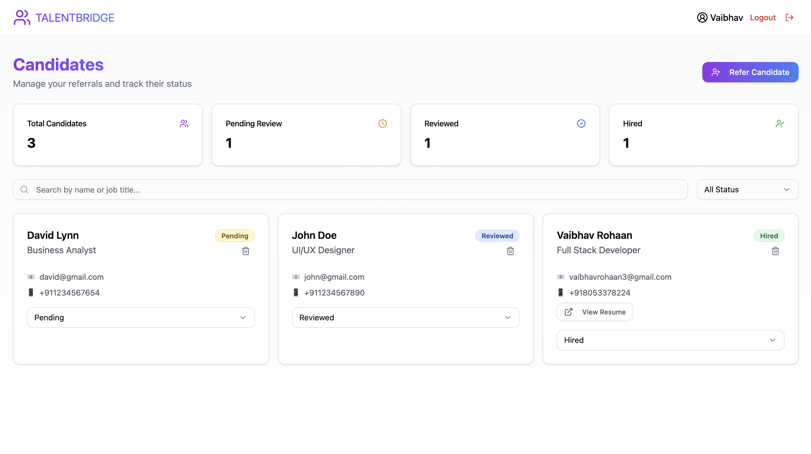

# Candidate Referral Management System

[](https://nodejs.org/)
[](https://reactjs.org/)


🔗 **Live Deployments:**
- Frontend: [https://referral-management.vercel.app/](https://referral-management.vercel.app/)
- API Docs: [https://referralmanagement.onrender.com/api-docs/](https://referralmanagement.onrender.com/api-docs/)


<div align="center">
  
</div>

## 🚀 Overview

A full-stack Candidate Referral Management System built with React and Node.js. This system allows users to manage candidate referrals, track their status, and streamline the hiring process.

## ✨ Features

### Frontend
- **Dashboard View**
  - List of all referred candidates
  - Search and filter functionality
  - Real-time status updates
  - Responsive candidate cards displaying key information

- **Referral Management**
  - Easy-to-use referral form
  - PDF resume upload support
  - Form validation
  - Status update functionality

### Backend
- **RESTful API**
  - Secure endpoints for CRUD operations
  - File upload handling
  - Data validation
  - Error handling

### Additional Features
- Email and phone number validation
- PDF file format restriction
- Responsive design
- Real-time updates

## 🛠️ Technology Stack

- **Frontend:**
  - React.js
  - React Hooks
  - Axios for API calls
  - Tailwind CSS

- **Backend:**
  - Node.js
  - Express.js
  - MongoDB
  - JWT for authentication

## 📝 API Endpoints

```
POST /candidates     - Create new candidate referral
GET /candidates     - Retrieve all candidates
PUT /candidates/:id/status - Update candidate status
DELETE /candidates/:id    - Remove candidate
```

## 🚀 Getting Started

### Prerequisites
- Node.js (v14 or higher)
- MongoDB
- npm or yarn

### Installation

1. Clone the repository
```bash
git clone https://github.com/vaibhxv/ReferralManagement.git
cd ReferralManagement
```

2. Install frontend dependencies
```bash
cd client
npm install
```

3. Install backend dependencies
```bash
cd api
npm install
```

4. Set up environment variables
```bash
# Backend .env
PORT=9999
MONGODB_URI=your_mongodb_uri
JWT_SECRET=jwt_secret
AWS_ACCESS_KEY_ID=access_id
AWS_SECRET_ACCESS_KEY=secret
AWS_REGION=region
AWS_BUCKET_NAME=bucket_name

# Frontend .env
VITE_APP_BACKEND_URL=http://localhost:9999
```

5. Start the development servers
```bash
# Backend
npm start

# Frontend
npm run dev
```


## 💡 Future Enhancements

- [ ] Advanced analytics dashboard
- [ ] Email notifications
- [ ] Resume parsing
- [ ] Integration with job boards
- [ ] Calendar integration for interviews

